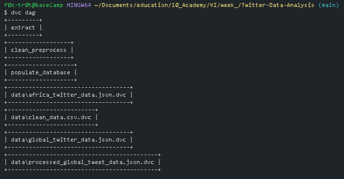

# Twitter Data Analysis
## Sentiment analysis and topic modeling

**Table of content**

- [Introduction](#introduction)
- [Overview](#overview)
- [Install](#install)
- [Data](#data)
- [Notebooks](#notebooks)
- [Models](#models)
- [Databases](#database)
- [Scripts](#scripts)
- [Pipelines](#pipelines)
- [Test](#test)
- [Author](#author)

## Introduction

> Starting on August 8, 2022, around 135 trainees along with the whole tutoring and managing team of 10 Academy officially started our week-long, highly intensive, and overwhelming journey of training/testing phase. 

> There were many forms of tests and training this week. Starting from data acquiring, engineering, transformations, cleaning, visualizations, and EDA, to modeling and machine learning engineering as well as other development skills and best practices like source code management, version control, CICD, debugging bug fixing, and testing. Also, data storage using SQL and other visualization using dashboards on platforms such as Streamlit or Heroku.


## Overview

> The purpose of this project is to extract sentiment analysis and topic modeling from the given two Twitter data sets by using several topic modeling models and sentiment analysis methods. After analyzing such insights the models built shall be also considering the inevitable cases of different types of data shifts. The sentiment analysis and the topic modeling models are a central object in the framework mentioned above, but it is often unknown, subject to personal knowledge and bias, or loosely connected to the available data. The main objective of the task is to highlight the importance of the matter in a concrete way. In this spirit, trainees are expected to attempt the following tasks:

    1.  Perform a sentiment analysis on the Twitter data set.
    2.  Perform topic modeling on the Twitter data set.
    3.  Get familiar with all the DevOps and MlOps tools provided.


## Install

```
git clone https://github.com/Fisseha-Estifanos/Twitter-Data-Analysis.git
cd Twitter-Data-Analysis
pip install -r requirements.txt
```

## Data

Data can be found [here at google drive](https://drive.google.com/drive/folders/19G8dmehf9vU0u6VTKGV-yWsQOn3IvPsd), and or [Global data set](https://drive.google.com/file/d/1sfx50_tQ6jyBENo0L7hM3WL-11RhWqEB/view?usp=sharing), or [African data set](https://drive.google.com/file/d/1219EjMcjCD4yLqTbBUauOE0-95dqhz4Q/view?usp=sharing)

## Notebooks

> All the preprocessing, analysis, EDA and examples of sentiment analysis and topic modeling implementation will be here in the form of .ipynb file in the notebooks folder.

## Models
> All the models generated will be found here in the models folder.

## Database
> All the databases generated will be found here in the databases folder.

## Scripts
> All the modules for the analysis are found here.

## Pipelines
> Dvc played a huge role in creating a reproducible pipelines real fast and easily. We can easily update the 'dvc.yml' file and create or add several steps to our cleaning, preprocessing, extracting, exploratory data analysis, sentiment analysis, topic modeling and database creation steps.

 

## Tests

> All the unit and integration tests are found here in the tests folder.

## Author

👤 **Fisseha Estifanos**

- GitHub: [Fisseha Estifanos](https://github.com/fisseha-estifanos)
- LinkedIn: [Fisseha Estifanos](https://www.linkedin.com/in/fisseha-estifanos-109ba6199/)

## Show us your support

Give us a ⭐ if you like this project!
